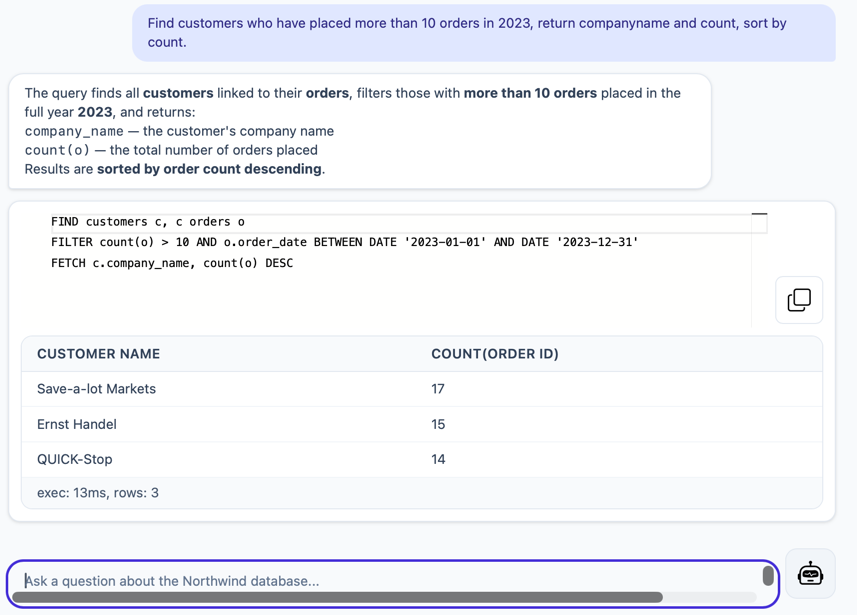

# Verifiable AI-Assisted Semantic Querying for Relational Databases

The [**koryki.ai**](https://koryki.ai "(koryki.ai platform)") platform enables human-readable and supervised interaction with relational databases.
It reduces complexity while preserving full control over what is queried and executed.

At its core is **KQL** (Koryki Query Language), a concise and human-readable language designed for ease of learning, interpretation, and validation.
A well-defined grammar is key to making queries reliable and verifiable — for both humans and large language models.

The purpose of **koryki** is:
- Shift control to human-centric queries
- Simplify data analysis
- Enhance workflows with AI while keeping full control
- Visualise results with a declarative `VISUALISE` clause (grammar of graphics)

[Read more](./docs/PURPOSE.md "purpose of the koryki.ai platform"), 
see  [sample query](./docs/SAMPLE_QUERY.md "sample query"),
or have a look at [a guide to Koryki Query Language](./docs/LANGUAGE.md "a guide to koryki query language").

A demo application is available at: [demo.koryki.ai](https://demo.koryki.ai "(demo.koryki.ai)").

[KQL-Grammar Reference](./docs/KQL_EBNF.md "purpose of the koryki.ai platform")

## Demo Chat Application

## Sub Projects

- **core**: the koryki core library
- **duckdb**: DuckDB dialect
- **mariadb**: MariaDB dialect
- **mssql**: Microsoft SQL Server dialect
- **northwind**: [`Northwind sample database`](./NOTICE "Northwind sample database") for testing purpose
- **oracle**: Oracle dialect
- **postgresql**: PostgreSQL dialect
- **snowflake**: Snowflake dialect
- **sqlite**: SQLite dialect
- **trino**: Trino dialect

 
## Developer Documentation
- Package [`ai.koryki.antlr`](./docs/ANTLR.md "package ai.koryki.antlr") – Grammar and parsing layer
- Package [`ai.koryki.iql`](./docs/IQL.md "package ai.koryki.iql") – Intermediate representation, **IQL** language, query rewriting rules and validation.
- Package [`ai.koryki.kql`](./docs/KQL.md "package ai.koryki.kql") – **KQL** language, transpiler and engine to retrieve results from databases
- Package [`ai.koryki.jdbc`](./docs/JDBC.md "package ai.koryki.jdbc") – JDBC database access
- Package [`ai.koryki.catalog`](./docs/SCAFFOLD.md "package ai.koryki.catalog") – Database schema description and semantic layer — see also [`Semantic Layer`](./docs/SEMANTIC_LAYER.md "Semantic Layer")

- [`KQL-Grammar definition`](./core/src/main/antlr/kql/KQL.g4 "KQL grammar")

## Contribution

**koryki** is in early stage and open source under
[`Apache 2.0 License`](./LICENSE "Apache 2.0 License")

Any kind of feedback is welcome: info@koryki.ai

## Acknowledgements

The VISUALISE language in Koryki is inspired by the excellent [`ggsql`](https://github.com/posit-dev/ggsql "ggsql") project from Posit. 
ggsql demonstrates how the principles of Leland Wilkinson's Grammar of Graphics can be expressed in a SQL-oriented syntax. 
Koryki integrates an adopted visualization grammar into its semantic query language while combining it with schema-aware 
querying.

## Related projects

[**ggsql**](https://github.com/posit-dev/ggsql) — a SQL extension for declarative data visualization based on the Grammar of Graphics, from Posit.