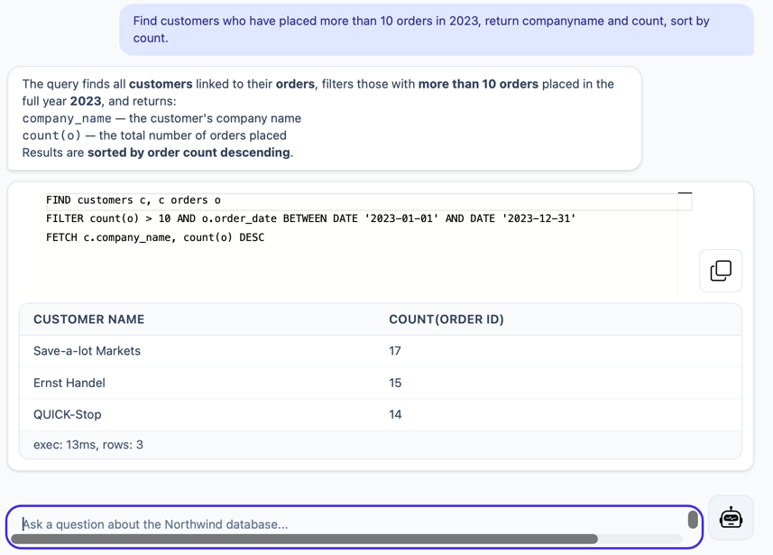

# Verifiable AI-Assisted Semantic Querying for Relational Databases

The [**koryki.ai**](https://koryki.ai "(koryki.ai platform)") platform enables human-readable and supervised interaction with relational databases.
It reduces complexity while preserving full control over what is queried and executed.

At its core is **KQL** (Koryki Query Language), a concise and human-readable language designed for ease of learning, interpretation, and validation.
A well-defined grammar is key to making queries reliable and verifiable — for both humans and large language models.


The purpose of **koryki** is:
- Shift control to human-centric queries
- Simplify data analysis
- Enhance workflows with AI while keeping full control


[Read more](./docs/PURPOSE.md "purpose of the koryki.ai platform"), 
see  [sample query](./docs/SAMPLE_QUERY.md "sample query"),
or have a look at [a guide to Koryki Query Language](./docs/LANGUAGE.md "a guide to koryki query language").


A demo application is available at: [demo.koryki.ai](https://demo.koryki.ai "(demo.koryki.ai)").

[KQL-Grammar Reference](./docs/KQL_EBNF.md "purpose of the koryki.ai platform")

## Installation

Add the core transpiler plus whichever database dialect(s) you need:

**Gradle (Kotlin DSL)**

```kotlin
dependencies {
    implementation("ai.koryki.core:koryki-core:0.1.0")
    implementation("ai.koryki.core:koryki-duckdb:0.1.0") // or postgresql, oracle, snowflake, sqlite, mariadb, mssql, trino
}
```

**Maven**

```xml
<dependency>
    <groupId>ai.koryki.core</groupId>
    <artifactId>koryki-core</artifactId>
    <version>0.1.0</version>
</dependency>
<dependency>
    <groupId>ai.koryki.core</groupId>
    <artifactId>koryki-duckdb</artifactId>
    <version>0.1.0</version>
</dependency>
```

Releases are signed — [`docs/RELEASES.md`](./docs/RELEASES.md) shows how to verify a download.

## Demo Chat Application



## Sub Projects

- **core**: the koryki core library
- **duckdb**: DuckDB dialect
- **mariadb**: MariaDB dialect
- **mssql**: Microsoft SQL Server dialect
- **northwind**: services for the [`Northwind sample database`](./NOTICE "Northwind sample database"); its DuckDB data and catalog come from the [`northwind`](https://github.com/koryki-java/northwind) repository
- **oracle**: Oracle dialect
- **postgresql**: PostgreSQL dialect
- **snowflake**: Snowflake dialect
- **sqlite**: SQLite dialect
- **testkit**: JUnit harness for the shared fixture corpus (`Fixtures`, `TestUtil`, `BaseEngineTest`) — a test dependency, kept out of `northwind` so applications using the sample database do not get JUnit
- **trino**: Trino dialect
- **tools**: documentation generators and maintenance tasks

 
## Developer Documentation
- Package [`ai.koryki.antlr`](./docs/ANTLR.md "package ai.koryki.antlr") – Grammar and parsing layer
- Package [`ai.koryki.iql`](./docs/IQL.md "package ai.koryki.iql") – Intermediate representation, **IQL** language, query rewriting rules and validation.
- Package [`ai.koryki.kql`](./docs/KQL.md "package ai.koryki.kql") – **KQL** language, transpiler and engine to retrieve results from databases
- Package [`ai.koryki.jdbc`](./docs/JDBC.md "package ai.koryki.jdbc") – JDBC database access
- Package [`ai.koryki.catalog`](./docs/SCAFFOLD.md "package ai.koryki.catalog") – Database schema description and semantic layer — see also [`Semantic Layer`](./docs/SEMANTIC_LAYER.md "Semantic Layer")

- [`KQL-Grammar definition`](./kqlcore/src/main/antlr/ai/koryki/kql/KQLParser.g4 "KQL grammar")
- [`SQL Injection`](./docs/INJECTION.md "injection paths, barriers and hardening strategy") – how author-controlled text reaches the rendered SQL, and what stops it


## Building & Testing

The shared KQL/IQL test-fixture corpus lives in the sibling
[`northwind`](https://github.com/koryki-java/northwind) repository and is vendored here as a git
submodule, so it's checked out automatically — pinned to a specific version — instead of requiring
a manual clone-and-configure step:

```
git submodule update --init
./gradlew test
```

`test.root` can still be pointed at a different local checkout (e.g. in
`~/.gradle/gradle.properties`) when developing against unreleased fixture changes; it defaults to
the submodule when unset. See [`northwind`'s `SPEC.md`](https://github.com/koryki-java/northwind/blob/main/SPEC.md)
for the corpus's format contract.

Enable the pre-push hook once per clone, so a key or password is caught before it reaches GitHub:

```
git config core.hooksPath githooks
```

It scans the commits being pushed and rejects the push if it finds a credential — with
[gitleaks](https://github.com/gitleaks/gitleaks) when installed, otherwise with a few built-in
patterns. `git push --no-verify` overrides it for a false positive. The `Secret scan` workflow
checks the full history on every push as well.

## Contribution

**koryki** is in early stage and open source under
[`Apache 2.0 License`](./LICENSE "Apache 2.0 License")

Any kind of feedback is welcome: info@koryki.ai

