# KQL Grammar

## Query

Query is the root rule of KQL-Language
- at least a query has one set
- optionally a query has one or more blocks

## Block

Block is an id followed by set or id followed by placeholder.

## Set

Set is an operation on sets or a select.

## Select

Select has four clauses:
- FIND with one source optionally followed by a list of links
- optionally filter_ clause
- optionally fetch_clause
- optionally limit_clause

## Link

Link has three alternatives:
- optionally from=ID of linked source, followed by source.
  If from=ID is missing, source is implicitly linked to the
  previous source in linklist.
- optionally ID of linked source, criteria-ID and source.
- optionally ID of linked source, source and criteria-ID.

Alternatives two and three are semantically identically.
Its for input-convenience as we want the user to choose order of
source and criteria.
Position of "-" indicates that the next ID is the criteria.
This differentiates alternative two from three.

## Logical Expression

Logical_expression resolves to boolean result.

## Unary Logical Expression

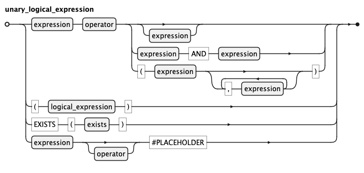

Unary_logical_expression resolves to boolean result. It has four main alternatives:
- expression and operator optionally followed by an expression, a pair of expression or a set of expressions
- recursive logical_expression in braces
- exists clause
- expression with placeholder, operation is optional, if missing placeholder must set operator too

## Limit Clause

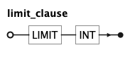

## Exists

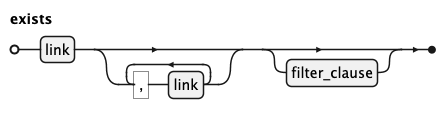

## Source

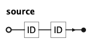

Source has two IDs:
- frist name
- second alias

## Filter Clause

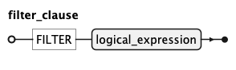

## Fetch Clause

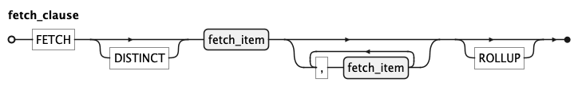

## Fetch Item

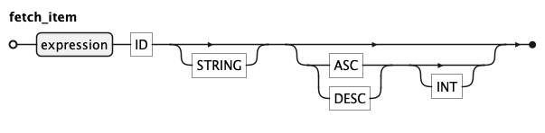

## Expression

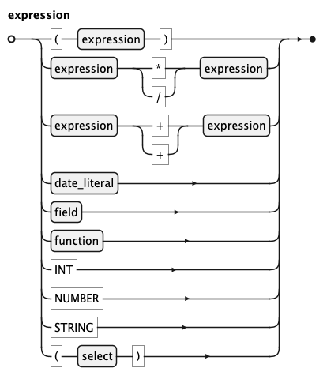

## Function

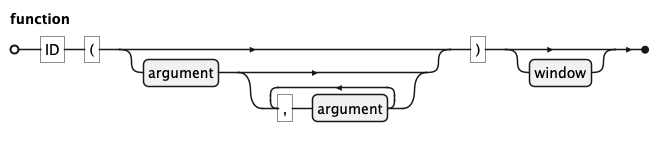

## Argument

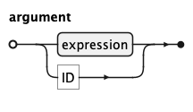

## Field

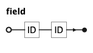

Source has two IDs:
- frist alias
- second name

## Window

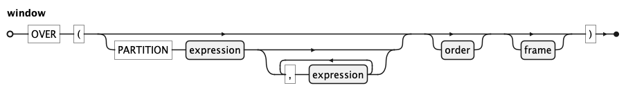

## Window Order

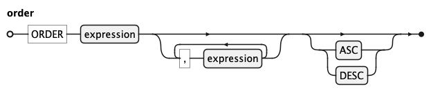

## Frame

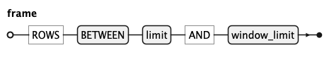

## Window Limit

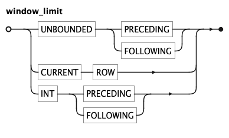

## Date literal

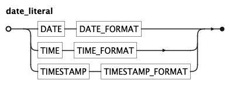
