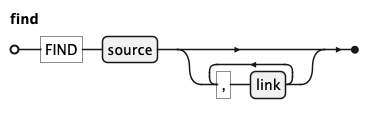
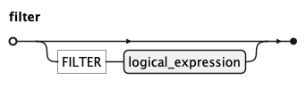
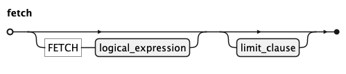
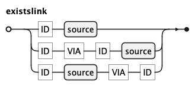

# KQL Grammar

KQL is inspired by SQL and shares many of its concepts, but operates at a higher level of 
abstraction. 
Readers familiar with SQL will recognize most operators and functions.

The key differences are in how sources are declared, how joins are expressed, 
and which clauses are omitted because KQL derives them automatically.
 
| Concept          | SQL                         | KQL                               | 
|------------------|-----------------------------|-----------------------------------| 
| Query sources    | `FROM` table t              | `FIND` entity alias               | 
| Filtering rows   | `WHERE`                     | `FILTER`                          | 
| Output columns   | `SELECT`                    | `FETCH`                           | 
| Joining          | `JOIN` ... ON ...           | link with -`+` / `VIA`               | 
| Grouping         | `GROUP BY` (explicit)       | inferred from `FETCH`             | 
| Aggregate filter | `HAVING` (explicit)         | inferred from `FILTER`            | 
| Sorting          | `ORDER BY` (separate clause) | `ASC`/`DESC` inline on `fetch_item` | 
| Sub-queries      | `WITH ... AS` (...)         | `WITH` block                      | 
| Existence check  | `EXISTS (SELECT 1 FROM ...)` | `EXISTS`(existslink ...)          | 
| Row limit        | `FETCH FIRST n ROWS ONLY`   | `LIMIT` n                         | 
| Identifiers      | case-insensitive            | strictly lowercase                | 
| Keywords         | case-insensitive            | strictly uppercase                |

The most significant omission is JOIN: **KQL** replaces explicit join conditions with named 
relationships from the semantic layer, so authors declare which entities to connect rather 
than how to connect them at the column level.

KQL is simpler than SQL by design — it does not compete with SQL — it compiles to SQL before execution, 
delegating the full power of the underlying database engine. This also makes KQL largely database 
agnostic: the same query runs across different databases without modification, as the 
transpiler handles database-specific SQL dialect differences.
Experts who find themselves missing advanced SQL features should write SQL directly.

## Lexical Conventions

Identifiers (ID) consist of lowercase letters, digits, and underscores, and must start with a lowercase letter or 
underscore. Uppercase is not permitted — all entity names, aliases, and attribute names must be lowercase. 

Comments are supported in two forms: block comments (/* ... */) and line comments (// ... to end of line). 
Both are ignored by the parser and can appear anywhere whitespace is allowed.

All KQL keywords are strictly uppercase (FIND, FILTER, FETCH, etc.), while all identifiers are strictly lowercase. This
hard separation means any token can be identified by its case alone — uppercase is always a language keyword,
lowercase is always a user-defined name such as an entity, alias, or attribute. This is more restrictive than SQL or most programming languages, which permit mixed case, but makes queries significantly easier to read and verify at a glance — for both human 
authors and AI-generated queries.


## Query


Query is the root rule of KQL-Language.

The optional `WITH` clause introduces named sub-queries (blocks) separated by commas.

The mandatory `set` at the end is the main result expression and may be a plain select or a set 
operation via `UNION`, `UNIONALL`, `MINUS`, or `INTERSECT`.


## Block


A `block` defines a named sub-query inside a 
`WITH` clause. The first alternative binds an identifier to a set-operation; 
the second binds an identifier to a placeholder, allowing the sub-query to be injected 
externally at runtime.

## Set


A `set` is either a plain `select` or a set-operation via 
`INTERSECT`, `UNION`, `UNIONALL`, or `MINUS`. `INTERSECT` binds 
more tightly than the other operators; parentheses can be used to override precedence.

## Select


`select` is the core query construct, built from up to four clauses. 
The mandatory `FIND` clause names the primary source and any linked sources to traverse.
It is followed by an optional `FILTER` clause for predicates, an optional `FETCH` clause defining the 
output expressions, and an optional `LIMIT` 
clause capping the number of returned rows.

**KQL** deliberately omits `GROUP BY`, `HAVING`, and `ORDER BY`. 
Grouping is inferred automatically whenever `FETCH` contains an 
aggregate expression. Aggregate predicates in `FILTER` are promoted to 
`HAVING` by the transpiler. Sort order is declared inline on
each `fetch_item` using `ASC` or `DESC`. This keeps queries 
concise and frees the user from SQL's clause-placement rules.

This omission is a key design feature. In **SQL**, misplacing an 
aggregate expression between `WHERE` and `HAVING`, or forgetting a column 
in `GROUP BY`, are frequent error sources — for both human authors 
and AI-generated queries. By deriving these clauses mechanically from 
the structure of `FIND`, `FILTER`, and `FETCH`, **KQL** eliminates 
an entire class of mistakes. A non-SQL-expert can read and verify a 
KQL select top to bottom without knowing SQL's clause-placement rules, 
and an AI model generating KQL 
needs to reason about far fewer structural constraints than it would 
generate equivalent SQL.

## Find



`FIND` introduces the graph of sources the query operates on. 
It requires exactly one primary `source`, optionally extended by a 
comma-separated list of linked sources.

## Filter



The `FILTER` clause narrows the result set by applying a logical predicate to 
the source rows matched by `FIND`. It accepts any `logical_expression`, 
including `AND`/`OR`/`NOT` combinations, comparisons, 
and `EXISTS` sub-queries.

## Fetch



`FETCH` declares what the `query` returns, projecting one or more 
expressions from the matched source rows. The optional `DISTINCT` 
keyword suppresses duplicate rows, and the optional 
`ROLLUP` keyword appends subtotal rows across grouping levels.

## Link


A `link` declares an additional `source` to join to the `source` graph. 
The optional first identifier specifies which 
already-declared `source` to join from; when absent, the `link` is 
implicitly attached to the preceding `source` in the list.

Literal `+` produces an optional `link` (LEFT OUTER JOIN), preserving rows
even when no matching counterpart is found in target `source`. A link without `+` produces a
mandatory link (INNER JOIN); rows are only returned when matching data exists in both sources.

When two sources share more than one relationship, a `criteria` identifier 
is mandatory. 
Keyword `VIA` introduces the `criteria` identifier and may appear before or after the target `source`.
Both alternatives (second and third) are semantically identical; the author may lead with whichever is known first — 
the `criteria` or the target `source`.

## Logical Expression


A `logical_expression` is a boolean predicate composed of 
`unary_logical_expression` base cases combined with `NOT`, `AND`, and `OR`. 
Standard boolean precedence applies — `NOT` binds most tightly, 
followed by `AND`, then `OR` — and parentheses override it.

## Unary Logical Expression


A `unary_logical_expression` is the atomic building block of boolean predicates 
in **KQL**. The most common form is: 

    expression operator right-hand-side

Where the right-hand side can be:
 - absent (ISNULL)
 - a single expression
 - a BETWEEN pair
 - a parenthesized IN list 

Three further alternatives exist:
- a logical_expression wrapped in parentheses for explicit grouping
- EXISTS, which tests whether a linked sub-graph contains at least one matching row.
- a `placeholder` form, marking positions where the caller supplies values at runtime.


## Limit Clause


LIMIT caps the number of rows returned by a select to the given integer value.

## Exists


`exists` defines the correlated sub-query used inside an `EXISTS` check. Unlike `select``, it produces 
no output — only a boolean indicating whether at least one matching row exists in the sub-graph.

## Existslink



## Source


`source` declares which entity to query and how to refer to it within the `query`. The first identifier is the entity name as 
defined in the semantic layer; the second is the `alias` used in all subsequent references (`link`, `FILTER`, and `FETCH` clauses).

## Filter Clause


`filter_clause` wraps a `logical_expression` introduced by the `FILTER` keyword. It appears in both 
`select` and `exists`, narrowing the matched rows in each context.

## Fetch Clause


`fetch_clause` is a list of `fetch_item` entries that determines what data appears in the result — 
the columns and computed values the `select` returns. 
The optional `DISTINCT` keyword removes duplicate rows from the result, and `ROLLUP` adds automatically
computed subtotal rows for grouped results.

When the list mixes plain fields with aggregate functions such as `count` or `sum`, 
**KQL** automatically groups the result by the plain fields — no explicit 
GROUP BY is needed. The fetch list therefore serves a dual purpose: it declares what to return 
and implicitly defines how rows are grouped.


## Fetch Item


A `fetch_item` is a single output expression — a field, a computed value, or an aggregate function. 
An optional `header` identifier gives the expression a name in the result, 
and an optional `label` provides a display string for UI rendering.

Each `fetch_item` can carry a sort direction (ASC or DESC), replacing the need for 
a separate ORDER BY clause.  When multiple items specify a sort direction, sort priority 
is determined by the position of each `fetch_item` in the fetch_clause. 
An optional integer index overrides this default 
and explicitly controls sort priority.

## Expression


An `expression` is a value-producing term used throughout the query. 
It covers arithmetic (`*`, `/`, `+`, `-`), field references, 
function calls, literals (`INT`, `NUMBER`, `SQ_STRING`, `NULL`), `date_literal`, 
and sub-selects. Parentheses can be used to group and override arithmetic precedence.

Literal values are written as integers (42), decimal numbers (3.14), single-quoted strings ('text'), NULL, or date literals.

## Function


A `function` is a named operation applied to zero or more arguments. Aggregate functions such as `count` or `sum` 
summarise values across rows; scalar functions transform a single value. An optional window clause turns any 
aggregate into a window function, computing the result over a defined partition of rows without 
collapsing them into a single output row.

## Argument


An `argument` is a value passed to a `function`. It is either an `expression` or a bare identifier, allowing functions 
to accept both computed values and entity references such as ```count(o)```.

## Field


A `field` references a single attribute of a `source` as alias.name, where alias identifies a `source` declared in 
`FIND` and name is the attribute name as defined in the semantic layer.

## Window


A window clause attaches to a function and defines the set of rows the function operates over, without collapsing 
them into a single result row. The optional `PARTITION` clause divides rows into independent groups; the optional 
`ORDER` clause defines the row sequence within each partition; and the optional frame clause narrows the window 
further to a subset of rows relative to the current row.

## Window Order


The `ORDER` clause inside a window defines the sequence in which rows are processed within each partition. It accepts 
one or more expressions and an optional ASC or DESC direction.

## Frame


A frame narrows the window to a sliding subset of rows relative to the current row, defined by a lower and upper 
`window_limit` bound. Only ROWS frames are supported, which count bounds by physical row offset rather than value range.

## Window Limit


A window_limit defines one boundary of a frame. `UNBOUNDED PRECEDING` or `UNBOUNDED FOLLOWING` extends the boundary to the 
first or last row of the partition; `CURRENT ROW` sets it to the current row; and an integer offset sets it to a 
fixed number of rows before or after the current row.

## Date literal


A date_literal pairs a type keyword with a formatted single-quoted string. 

| Keyword   | Format                              | Example                         | 
|-----------|-------------------------------------|---------------------------------| 
| DATE      | 'YYYY-MM-DD'                        | DATE '2023-01-31'               | 
| TIME      | 'HH:MI:SS[.mmm][±HH:MI]'            | TIME '14:30:00'                 | 
| TIMESTAMP | 'YYYY-MM-DD HH:MI:SS[.mmm][±HH:MI]' | TIMESTAMP '2023-01-31 14:30:00' |