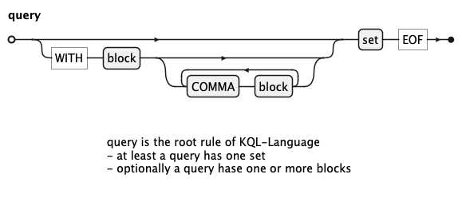
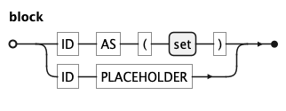
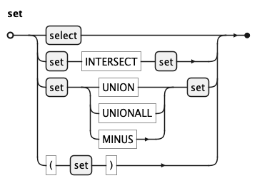
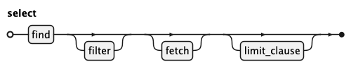
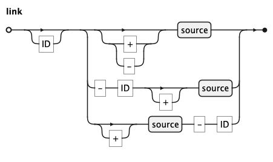
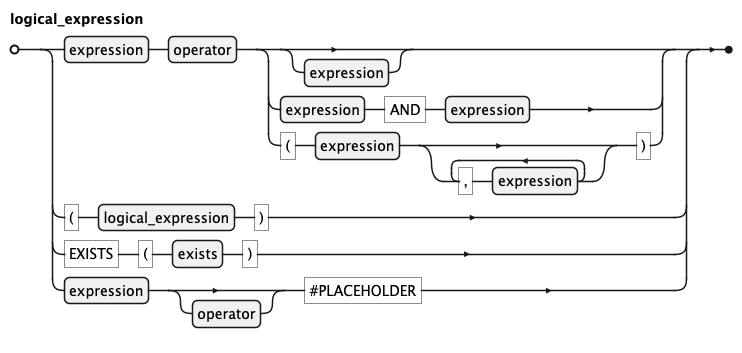

# KQL Grammar

## Query

query is the root rule of KQL-Language
- at least a query has one set
- optionally a query hase one or more blocks

## Block

block is an id followed by set or id followed by placeholder

## Set

set is an operation on sets or a select

## Select

select has four clauses:
- FIND with one source optionally followed by a list of links
- optionally FILTER clause
- optionally FETCH clause
- optionally LIMIT clause

## Link

link has three alternatives:
- optionally from=ID of linked source, followed by source.
  If from=ID is missing, source is implicitly linked to the
  previous source in linklist.
- optionally ID of linked source, criteria-ID and source.
- optionally ID of linked source, source and criteria-ID.

Alternatives two and three are semantically identically.
Its for input-convenience as we want the user to choose order of
source and criteria.
position of "-" indicates that the next ID is the criteria.
This differentiates alternative two from three.

## Logical Expression

link has three alternatives:
- optionally from=ID of linked source, followed by source.
  If from=ID is missing, source is implicitly linked to the
  previous source in linklist.
- optionally ID of linked source, criteria-ID and source.
- optionally ID of linked source, source and criteria-ID.

Alternatives two and three are semantically identically.
Its for input-convenience as we want the user to choose order of
source and criteria.
position of "-" indicates that the next ID is the criteria.
This differentiates alternative two from three.

## Logical Expression

logical_expression to boolean result. It has four main alternatives:
- expression and operator optionally followed by an expression, a pair of expression or a set of expressions
- recursive logical_expression in braces
- exists clause
- expression with placeholder, operation is optional, if missing placeholder must set operator too

sdfsf