# KQL Grammar — Koryki Query Language Reference

Koryki Query Language (**KQL**) is inspired by SQL and shares many of its concepts, but operates at a higher level of abstraction.
Readers familiar with SQL will recognize most operators and functions.

The key differences are in how sources are declared, how joins are expressed, 
and which clauses are omitted because **KQL** derives them automatically.

**KQL** is simpler than SQL by design; it does not compete with SQL — it compiles to SQL before execution, 
delegating the full power of the underlying database engine. This also makes **KQL** largely database 
agnostic: the same query runs across different databases without modification, as the 
transpiler handles database-specific SQL dialect differences.

## Lexical Conventions

Identifiers (`ID`) consist of lowercase letters, digits, and underscores, and must start with a lowercase letter or 
underscore. Uppercase is not permitted — all entity names, aliases, and attribute names must be lowercase. 

Comments are supported in two forms: block comments (`/* ... */`) and line comments (`// ...` to end of line). 
Both are ignored by the parser and can appear anywhere whitespace is allowed.

All **KQL** keywords are strictly uppercase (`FIND`, `FILTER`, `FETCH`, etc.), while all identifiers are strictly lowercase. This
hard separation means any token can be identified by its case alone — uppercase is always a language keyword,
lowercase is always a user-defined name such as an entity, alias, or attribute. 
This is more restrictive than SQL or most programming languages, which permit mixed case, but makes queries significantly easier to read and verify at a glance — for both human 
authors and AI-generated queries.


## KQL Query Rule

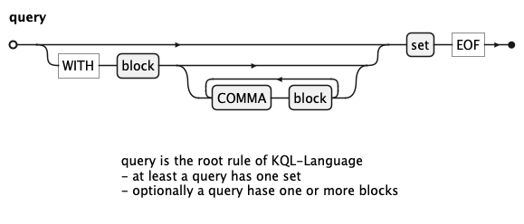

`query` is the root rule of **KQL**.

The optional `WITH` clause introduces named sub-queries (blocks) separated by commas.

The mandatory `set` at the end is the main result expression and may be a plain `select` or a set 
operation via `UNION`, `UNIONALL`, `MINUS`, or `INTERSECT`.


## KQL Block Rule

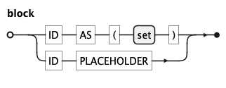

A `block` defines a named sub-query inside a 
`WITH` clause. The first alternative binds an identifier to a `set`; 
the second binds an identifier to a placeholder, allowing the sub-query to be injected 
externally at runtime. Injecting it is the caller's job, and the only way the block acquires a
body — see [Placeholders](#placeholders) for what happens to one that is never filled.

## KQL Set Rule

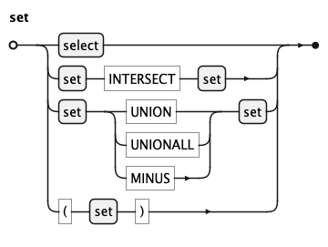

A `set` is either a plain `select` or a `set` operation via 
`INTERSECT`, `UNION`, `UNIONALL`, or `MINUS`. `INTERSECT` binds 
more tightly than the other operators; parentheses can be used to override precedence.

## KQL Select Rule

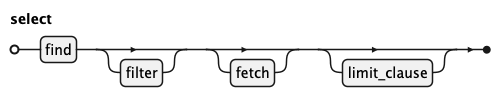

`select` is the core query construct, built from up to four clauses. 
The mandatory `FIND` clause names the primary source and any linked sources to traverse.
It is followed by an optional `FILTER` clause for predicates, an optional `FETCH` clause defining the 
output expressions, and an optional `LIMIT` 
clause capping the number of returned rows.

**KQL** deliberately omits `GROUP BY`, `HAVING`, and `ORDER BY`. 
Grouping is inferred automatically whenever `FETCH` contains an 
aggregate expression. Aggregate predicates in `FILTER` are promoted to 
`HAVING` by the transpiler. Sort order is declared inline on
each `fetch_item` using `ASC` or `DESC`. This keeps queries 
concise and frees the user from SQL's clause-placement rules.

This omission is a key design feature. In **SQL**, misplacing an 
aggregate expression between `WHERE` and `HAVING`, or forgetting a column 
in `GROUP BY`, are frequent error sources — for both human authors 
and AI-generated queries. By deriving these clauses mechanically from 
the structure of `FIND`, `FILTER`, and `FETCH`, **KQL** eliminates 
an entire class of mistakes. A non-SQL-expert can read and verify a 
**KQL** `select` top to bottom without knowing SQL's clause-placement rules, 
and an AI model generating KQL 
needs to reason about far fewer structural constraints than it would 
to generate equivalent SQL.

## KQL Find Rule

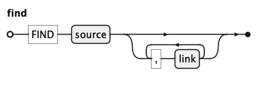

`FIND` introduces the graph of sources the query operates on. 
It requires exactly one primary `source`, optionally extended by a 
comma-separated list of linked sources.


## KQL Filter Rule

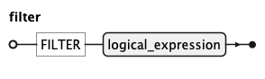

The `FILTER` clause narrows the result set by applying a logical predicate to
the source rows matched by source-graph in `find`rule and `exists`rule.
It accepts any `logical_expression`.


## KQL Fetch Rule

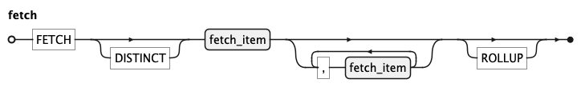

`fetch` is a list of `fetch_item` entries that determines what data appears in the result —
the columns and computed values the `select` returns.
The optional `DISTINCT` keyword removes duplicate rows from the result, and `ROLLUP` adds automatically
computed subtotal rows for grouped results.

`ROLLUP` is the one clause that is not available on every dialect, and the limits are checked before
the query runs rather than left to the database driver:

- **SQLite** has no `GROUP BY ROLLUP` at all and rejects any query using it.
- **MariaDB** supports it (rendered as a trailing `WITH ROLLUP`), but not together with sorting on the
  same `select` — the server refuses that combination. Sort in an enclosing query instead.

When the list mixes plain fields with aggregate functions such as `count` or `sum`,
**KQL** automatically groups the result by the plain fields — no explicit
`GROUP BY` is needed. The fetch list therefore serves a dual purpose: it declares what to return
and implicitly defines how rows are grouped.


## KQL Fetch Item Rule

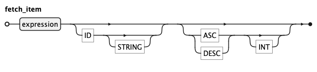

A `fetch_item` is a single output expression — a field, a computed value, or an aggregate function.
An optional `header` identifier gives the expression a name in the result.
A `label` is a double-quoted display string for UI rendering and may only appear when a `header` is present —
a label without a header is not permitted.

Each `fetch_item` can carry a sort direction (`ASC` or `DESC`), replacing the need for
a separate `ORDER BY` clause. When multiple items specify a sort direction, sort priority
is determined by the position of each `fetch_item` in the `fetch`.
An optional integer index overrides this default
and explicitly controls sort priority.

## KQL Limit Rule

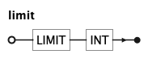

`LIMIT` caps the number of rows returned by a `select` to the given integer value.


## KQL Link Rule

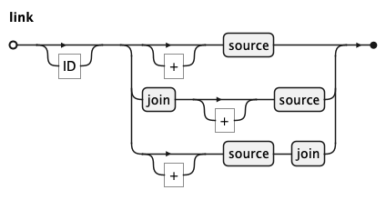

A `link` declares an additional `source` to join to the source graph. 
The optional first identifier specifies which 
already-declared `source` to join from; when absent, the `link` is 
implicitly attached to the preceding `source` in the list.

Literal `+` produces an optional `link` (LEFT OUTER JOIN), preserving rows
even when no matching counterpart is found in target `source`. A link without `+` produces a
mandatory link (INNER JOIN); rows are only returned when matching data exists in both sources.

A `link` may name the columns it joins on — that is the `join`. It is **required** when two sources
share more than one relationship, because nothing else could say which one is meant, and it is
**always permitted**: `FIND orders o, [order_id] order_details od` is valid even though that pair has
exactly one relationship, and writing it out says in the query what would otherwise be looked up in
the schema. The `join` may appear before or after the target `source`; the second and third
alternatives are semantically identical, so the author may lead with whichever is known first, the
join or the target `source`.

## KQL Join Rule

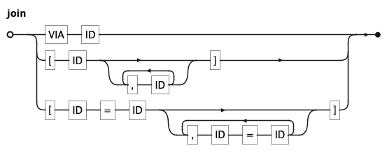

A `join` answers one question: which columns are compared. It offers three ways to say so.

`VIA name` names a relationship the semantic layer already declares, and the catalog resolves
it to the columns. This is the form to prefer — the relationship is defined once and every
query that uses it stays correct when the schema changes.

The two bracket forms write the columns out instead. `[a, b]` applies when both sides use the
same names; `[a = x, b = y]` pairs them explicitly. The first is only shorthand for the second,
so both mean the same thing and produce the same SQL.

**The order is part of the meaning.** The lists are compared position by position, so `[a, b]`
and `[b, a]` pair the columns differently as soon as the two sides are not symmetric.

Only columns the semantic layer exposes as attributes can be named. A column that exists in the
database but not in the model is reachable through a declared relationship, not by writing it
out — which is the same rule that applies everywhere else a column is named in KQL.

## KQL Logical Expression Rule

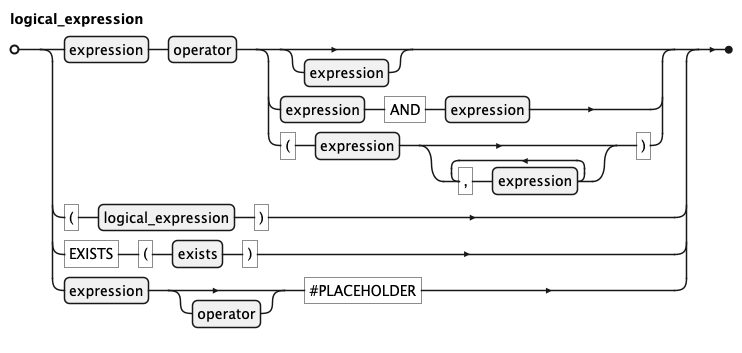

A `logical_expression` is a boolean predicate composed of 
`unary_logical_expression` base cases combined with `NOT`, `AND`, and `OR`. 
Standard boolean precedence applies — `NOT` binds most tightly, 
followed by `AND`, then `OR` — and parentheses override it.

## KQL Unary Logical Expression Rule

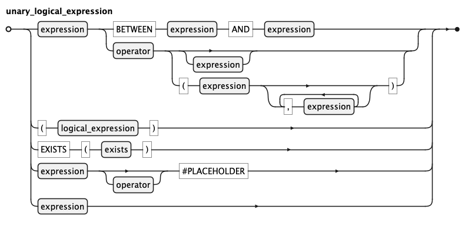


A `unary_logical_expression` is the atomic building block of boolean predicates 
in **KQL**. The most common form is: 

    expression operator right-hand-side

Where the right-hand side can be:
 - absent (`ISNULL`)
 - a single expression
 - a parenthesized `IN` list 

`BETWEEN` is a form of its own, not a member of `operator`:

    expression BETWEEN low AND high

Its `AND` belongs to the range and binds tighter than the logical `AND`, exactly
as in SQL. So `a BETWEEN 1 AND 2 AND b` is a range test combined with the
predicate `b`. Keeping `BETWEEN` out of `operator` is what makes that
unambiguous. PostgreSQL resolves the same ambiguity differently — by restricting
which expressions may follow `BETWEEN` and advising parentheses around a compound
bound, see
[functions-comparison](https://www.postgresql.org/docs/current/functions-comparison.html).
**KQL needs no such restriction**, because an `expression` cannot contain a
logical `AND` in the first place; a compound bound like `BETWEEN 1 + 2 AND 5`
therefore needs no parentheses.

Three further alternatives exist:
- a `logical_expression` wrapped in parentheses for explicit grouping
- `exists`, which tests whether a linked sub-graph contains at least one matching row.
- a `placeholder` form, marking positions where the caller supplies values at runtime.

### Placeholders

A placeholder — `#x`, `#laender`, `#p` — marks a position the caller fills before the query runs.
There are two of them in the grammar: a value inside a comparison (`FILTER o.freight > #x`) and a
whole sub-query bound to a block (`WITH ord #p`).

A query that still carries one **is rejected**, with a violation positioned on the `#name`. A
template is not a query, and there is nothing to render: filling the hole is the caller's job, and
until it is filled every later stage would be working on a gap. The rule exists because rendering it
anyway had four different outcomes, two of them silent — `FILTER o.freight #x` produced
`WHERE o.freight null`, and `FILTER c.country IN #laender` produced `WHERE c.country IN ()`, which
some engines accept and answer with zero rows. The fixtures recording each form are
`queries/kql/northwind/validation/invalid_placeholder_*.kql`.

Finally, an `expression` may stand alone as a predicate — `FILTER p.discontinued`,
`FILTER starts_with(c.company_name, 'A')`. It is the last alternative, so it only
applies when no operator follows, and validation requires it to be BOOLEAN.

## KQL Operator Rule

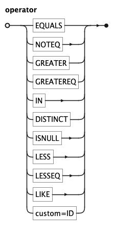

The comparison operators a `unary_logical_expression` may use. `ISNULL` takes no
right-hand side, `IN` takes a parenthesized list, the rest take a single expression.

The last alternative is an **identifier**: an operator the catalog defines rather than
the grammar. That is what keeps the operator set open — a dialect can add one without
touching the grammar. `BETWEEN` is deliberately not a member here; it has a production
of its own, so that its `AND` cannot be read as the logical one.

**KQL keywords are upper case.** The lexer defines them as literals and `ID` matches lower case only,
so a lower-cased operator does not reach its own alternative — it lands in the identifier escape
hatch above and would be passed through to SQL as a catalog operator that does not exist. An
identifier differing from a built-in operator only in case is therefore rejected, naming the spelling
it wants:

```kql
FIND customers c FILTER c.country distinct c.city FETCH c.company_name
  →  'distinct' is not a KQL operator — write it as 'DISTINCT'; KQL keywords are upper case
```

The same applies to `like`, `in` and every other operator keyword. It is the mistake a reader coming
from SQL makes first, and it used to be silent: the pass-through rendered ANSI
`IS NOT DISTINCT FROM` anyway, because the normalising template matched while the MariaDB and Oracle
overrides — which compare exactly — did not fire, and both engines then rejected the statement.

## KQL Exists Rule

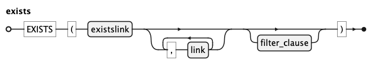

`EXISTS` introduces the correlated sub-graph of sources the exits-check operates on.
Unlike `select`, it produces 
no output — only a boolean indicating whether at least one matching row exists in the sub-graph.

## KQL Existslink Rule

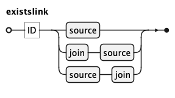

An `existslink` is the mandatory first link inside an `exists` clause. 
Unlike a regular `link`, the `from` identifier is always required and `+` is not 
permitted — existence checks are inherently about whether matching rows are found, 
making optional joins meaningless in this context. It takes the same `join` in the same
two placements as a `link` does.

## KQL Source Rule

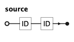

`source` declares which entity to query and how to refer to it within the `select`. The first identifier is the entity name as 
defined in the semantic layer; the second is the `alias` used in all subsequent references (`link`, `FILTER`, and `FETCH` clauses).


## KQL Expression Rule

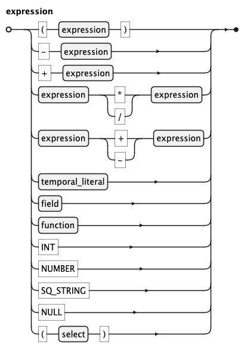

An `expression` is a value-producing term used throughout the query.
It covers unary negation (`-expr`, `+expr`), arithmetic (`*`, `/`, `+`, `-`), field references,
function calls, literals (`INT`, `NUMBER`, `SQ_STRING`, `NULL`), `temporal_literal`,
and sub-selects. Parentheses can be used to group and override arithmetic precedence.

Unary `-` negates a value; unary `+` is a no-op included for symmetry. Both bind more tightly than
binary operators, so `-a * b` means `(-a) * b`. Use parentheses to negate a compound expression:
`-(a * b)`.

Literal values are written as integers (`42`), decimal numbers (`3.14`), single-quoted strings (`'text'`), `NULL`, or date literals.
Negative literals are written with a leading unary minus: `-3.14`.

## KQL Function Rule

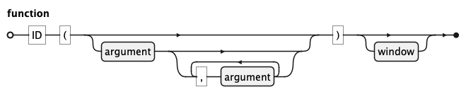

A `function` is a named operation applied to zero or more `argument`s. Aggregate functions such as `count` or `sum` 
summarise values across rows; scalar functions transform a single value. An optional `window` clause turns any 
aggregate into a window function, computing the result over a defined partition of rows without 
collapsing them into a single output row.

## KQL Argument Rule

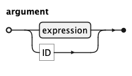

An `argument` is a value passed to a `function`. It is an `expression`, a `logical_expression`, or a
bare identifier — allowing functions to accept computed values, conditions, and entity references
such as `count(o)`.

The `logical_expression` alternative carries `case`, which would otherwise be unwritable:

```kql
FIND products p FETCH case(p.unit_price > 10 AND p.units_in_stock > 5, 1, 0) x
  →  CASE WHEN (p.unit_price > 10 AND p.units_in_stock > 5) THEN 1 ELSE 0 END AS x
```

`expression` is listed first on purpose. A bare expression is also a valid `logical_expression` (the
boolean-predicate alternative), so putting `logical_expression` first would swallow every plain
argument; a genuine predicate like `p.unit_price > 10` is not a viable `expression` and still reaches
the second alternative.

## KQL Field Rule

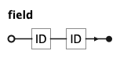

A `field` references a single attribute of a `source` as `alias.name`, where `alias` identifies a `source` declared in 
`FIND` and `name` is the attribute name as defined in the semantic layer.

## KQL Window Rule

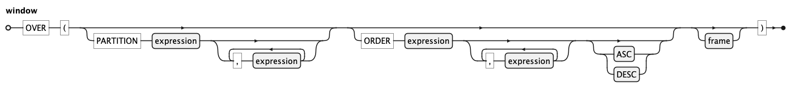

A `window` clause attaches to a `function` and defines the set of rows the function operates over, without collapsing 
them into a single result row. The optional `PARTITION` clause divides rows into independent groups; the optional 
`ORDER` clause defines the row sequence within each partition; and the optional `frame` clause narrows the window 
further to a subset of rows relative to the current row.

## KQL Window Order Rule

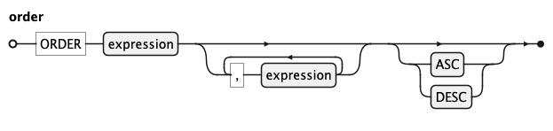

The `ORDER` clause inside a `window` defines the sequence in which rows are processed within each partition. It accepts 
one or more expressions and an optional `ASC` or `DESC` direction.

## KQL Frame Rule

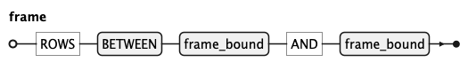

A `frame` narrows the window to a sliding subset of rows relative to the current row, defined by a lower and upper 
`window_limit` bound. Only `ROWS` frames are supported, which count bounds by physical row offset rather than value range.

## KQL Frame Bound Rule

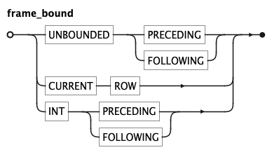

A `frame_bound` defines one boundary of a `frame`. `UNBOUNDED PRECEDING` or `UNBOUNDED FOLLOWING` extends the boundary to the 
first or last row of the partition; `CURRENT ROW` sets it to the current row; and an integer offset sets it to a 
fixed number of rows before or after the current row.

## KQL Temporal literal Rule

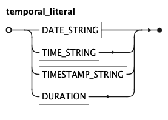

A `temporal_literal` is a double-quoted temporal value or a compact `DURATION` token —
a date, a time, a timestamp or a duration, which is why it is not called a date literal.
Double quotes delimit temporal values; single quotes delimit text strings — a consistent,
learnable distinction that also eliminates ambiguity with arithmetic operators.

The one exception is the `label` of a [fetch_item](#kql-fetch-item-rule), the single place in the
whole parser where a double-quoted token (`STRING`) means free text. Everywhere else double quotes
mean *temporal*, and that has a consequence worth stating: a malformed date is a **syntax error**,
not silently a piece of text.

```kql
FIND orders o FILTER o.order_date = "2023-01-31" FETCH o.order_id
  →  o.order_date = DATE '2023-01-31'
FIND orders o FILTER o.order_date = "2023-13-01" FETCH o.order_id
  →  mismatched input '"2023-13-01"'
FIND customers c FILTER c.country = "Germany" FETCH c.company_name
  →  mismatched input '"Germany"'
```

The lexer decides by shape, before the parser sees the position: `MM` is `'0'[1-9] | '1'[0-2]`, so
month 13 cannot be part of a `DATE_STRING` and the token falls through to `STRING`. The same rule
runs the other way in the label position, which is the surprising half:

```kql
FIND customers c FETCH c.country land "2023-13-01"
  →  c.country AS land
FIND customers c FETCH c.country land "2023-01-31"
  →  extraneous input '"2023-01-31"'
```

A column label that happens to be a valid date is therefore not writable. That is the price of
deciding the token type lexically, and it is worth knowing before it surprises someone building
date-keyed pivot columns.

| Token              | Format                                        | Example                              |
|--------------------|-----------------------------------------------|--------------------------------------|
| `DATE_STRING`      | `"YYYY-MM-DD"`                                | `"2023-01-31"`                       |
| `TIME_STRING`      | `"HH:MI:SS[.mmm][±HH:MI\|Z]"`                | `"14:30:00"`                         |
| `TIMESTAMP_STRING` | `"YYYY-MM-DD HH:MI:SS[.mmm][±HH:MI\|Z]"`     | `"2023-01-31 14:30:00"`              |
| `DURATION`         | `<n>(ms\|s\|min\|h\|d\|w\|mo\|q\|y)`         | `30d`, `2h`, `15min`                 |

`TIMESTAMP_STRING` uses a natural space separator between date and time; the surrounding
quotes make the space unambiguous to the lexer.

`DURATION` is a compact notation for a time span used in date arithmetic. A duration may carry
several components — `1y2mo`, `2d4h`, `1y2mo15d4h` — and they **must be written largest unit
first**. The grammar accepts any order; the validator does not, and says which order it wants:

```kql
FIND orders o FETCH o.order_date - 1y2mo d
  →  o.order_date - INTERVAL '1 year 2 month' AS d
FIND orders o FETCH o.order_date - 2mo1y d
  →  duration '2mo1y' must list components largest-unit-first — write '1y2mo'
```

The rule exists so that the written order matches the order in which the components are applied;
silently reordering the literal would make the text and the arithmetic disagree. See
[TEMPORAL.md](TEMPORAL.md) for why the order changes the result at all.

The sign is not part of the token: a leading `-` is a unary minus applied to the duration, not a
character of the literal. Both spellings work and mean the same thing —

```kql
FIND orders o FETCH o.order_date - 30d d
  →  o.order_date - INTERVAL '30 day' AS d
FIND orders o FETCH o.order_date + -30d d
  →  o.order_date + INTERVAL '-30 day' AS d
FIND orders o FETCH o.order_date + -2d4h d
  →  o.order_date + INTERVAL '-2 day -4 hour' AS d
```

— note that the minus reaches **every** component of a multi-component duration. It once bound to the
first only, so `-2d4h` meant `-2d + 4h`: eight hours off, with no error anywhere.


## Concept SQL & KQL

| Concept          | SQL                         | KQL                               | 
|------------------|-----------------------------|-----------------------------------| 
| Query sources    | `FROM` table t              | `FIND` entity alias               | 
| Filtering rows   | `WHERE`                     | `FILTER`                          | 
| Output columns   | `SELECT`                    | `FETCH`                           | 
| Joining          | `JOIN` ... ON ...           | `link` with `+` / `join`           | 
| Grouping         | `GROUP BY` (explicit)       | inferred from `FETCH`             | 
| Aggregate filter | `HAVING` (explicit)         | inferred from `FILTER`            | 
| Sorting          | `ORDER BY` (separate clause) | `ASC`/`DESC` inline on `fetch_item` | 
| Sub-queries      | `WITH ... AS` (...)         | `WITH` block                      | 
| Existence check  | `EXISTS (SELECT 1 FROM ...)` | `EXISTS`(existslink ...)          | 
| Row limit        | `FETCH FIRST n ROWS ONLY`   | `LIMIT` n                         | 
| Identifiers      | case-insensitive            | strictly lowercase                | 
| Keywords         | case-insensitive            | strictly uppercase                |

The most significant omission is JOIN: **KQL** replaces explicit join conditions with named
relationships from the semantic layer, so authors declare which entities to connect rather
than how to connect them at the column level.
