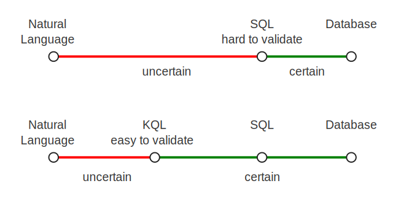
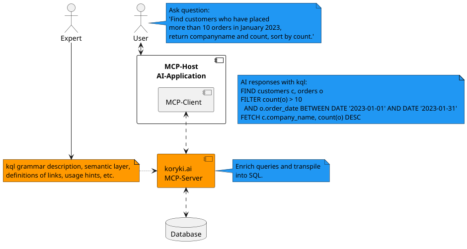

# Shift Control to Human-Centric Queries

Enable users to validate and reason about queries directly in a simple, readable form aligned with their intent.

Traditional Text-to-SQL systems place the burden of understanding SQL on the user: to trust the results, they must be able to validate SQL.
**koryki** takes a different approach. The critical validation point is shifted from SQL to **KQL** — a compact, understandable, and less error-prone language.
From there, transformation into SQL is deterministic and rule-based.

# Reducing Complexity in Data Analysis

**koryki** introduces several layers of abstraction to simplify how users work with data:

- **Business-oriented modeling**
Instead of exposing raw database schemas, koryki presents a semantic layer built on domain-specific terms that users naturally understand.
- **Abstracted relationships**
Entity relationships are labeled and managed internally, removing the need for users to define join conditions.
- **Context-aware simplification**
Queries can omit details that are either obvious to humans, inferred from context, or handled automatically by AI.
- **Hidden technical optimizations**
Database-specific implementation details—such as partitioning, indexing strategies, or precalculated values—are abstracted away from the user.

Each abstraction step is deterministic and systematically processed, ensuring that the resulting queries remain predictable and reliable. This structure allows SQL generation to be handled with precision while keeping user-facing queries simple and transparent.

# AI assistance

A simple and well-defined grammar is essential for making queries easier to create and validate—for both humans and Large Language Models. 

With the help of the koryki.ai MCP–Server, users can gain read access to databases with the support of an AI-model, see
[Model-Context-Protocol](https://modelcontextprotocol.io/docs/getting-started/intro "(MCP)").

See: [demo.koryki.ai](https://demo.koryki.ai "(demo.koryki.ai)").
