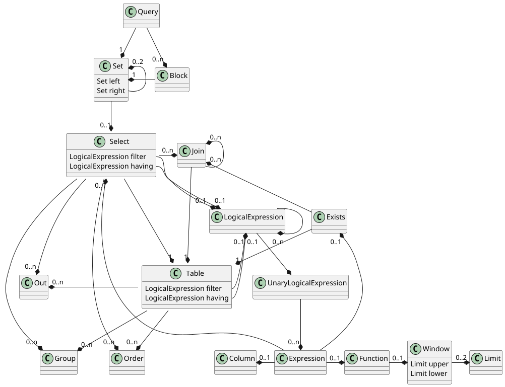

# Rules for the Intermediate Model in SQL Generation

## Overview

Each KQL query is transformed into an intermediate object model prior to SQL generation.




All transformation rules operate exclusively on this intermediate object model.
After rule processing is complete, the final SQL statement is generated from the transformed model.

---

# Transformation Rules

## 1. Push Logical Expressions to Outer-Joined Tables

**Rule:** `PushLogicalExpressionRule`

Optional linked tables may contain additional filter conditions.
In SQL, such conditions must be placed inside the `ON` clause of the `OUTER JOIN`.
If they are placed in the `WHERE` clause, the `OUTER JOIN` semantics are destroyed and effectively converted into an `INNER JOIN`.

`PushLogicalExpressionRule` moves logical expressions from the `SELECT` filter or having to the appropriate joined table.

### Example

Move the expression
`o.order_data BETWEEN DATE '2023-01-01' AND DATE '2023-12-31'`
to table `orders`.

```
    // give customers and optional count of orders in 2023

    FIND customers c, c+orders o
    FILTER o.order_data BETWEEN DATE '2023-01-01' AND DATE '2023-12-31'
    FETCH c.company_name, count(o)
```

### Expected SQL

```
    SELECT
    c.company_name
    , count(o.order_id)
    FROM
     customers c
     LEFT OUTER JOIN orders o ON
      c.customer_id = o.customer_id
     AND
      o.order_data BETWEEN DATE '2023-01-01' AND DATE '2023-12-31'
    GROUP BY
     c.company_name
```

### Incorrect SQL (Without Rule Application)

```
    SELECT
    c.company_name
    , count(o.order_id)
    FROM
     customers c
     LEFT OUTER JOIN orders o ON
      c.customer_id = o.customer_id
    WHERE 
      o.order_data BETWEEN DATE '2023-01-01' AND DATE '2023-12-31'
    GROUP BY
     c.company_name
```

This invalid transformation destroys `OUTER JOIN` behavior.
The user explicitly requested an optional count of orders; therefore, the `LEFT OUTER JOIN` semantics must be preserved.

---

## 2. Add GROUP Expressions for Non-Aggregate OUT Expressions

**Rule:** `GroupRule`

If at least one aggregate expression appears in the `OUT` clause, SQL requires all non-aggregate expressions to be included in the `GROUP BY` clause.

In the previous example, `count(o)` is detected as an aggregate expression.
Therefore, `c.company_name` is automatically added to the `GROUP BY` clause.

---

## 3. Push Aggregate Filter Expressions to HAVING Clause

**Rule:** `HavingRule`

Filter expressions that contain aggregate functions must not appear in the `WHERE` clause.
Instead, they must be placed in the `HAVING` clause.

### Example

```
    // Find customers who have placed more than 10 orders in January 2023,
    // return companyname and count, sort by count.
    
    FIND customers c, c-orders o
    FILTER count(o) > 10 AND o.order_date BETWEEN DATE '2023-01-01' AND DATE '2023-12-31'
    FETCH c.company_name, count(o) DESC
```

This query uses an `INNER JOIN`.
The expression `count(o) > 10` is an aggregate expression.

### Expected SQL

```
    SELECT
      c.company_name
    , count(o.order_id)
    FROM
     customers c
      INNER JOIN orders o ON
       c.customer_id = o.customer_id
    WHERE
     o.order_date BETWEEN DATE '2023-01-01' AND DATE '2023-12-31'
    GROUP BY
     c.company_name
    HAVING
     count(o.order_id) > 10
    ORDER BY
     count(o.order_id) DESC
```

Placing `count(o) > 10` inside the `WHERE` clause would result in invalid SQL.

---

## 4. Push Expressions to Tables

Expressions are classified as:

* **Homogeneous expressions** — reference at most one table.
* **Heterogeneous expressions** — reference two or more tables.

Homogeneous expressions are assigned to their referenced table.
Heterogeneous expressions remain at the `SELECT` level.

### 4.1 Push OUT Expressions

**Rule:** `PushOutRule`

Homogeneous expressions in the `OUT` clause of `SELECT` are pushed down to the referenced table.

---

### 4.2 Push GROUP Expressions

**Rule:** `PushGroupRule`

Homogeneous expressions in the `GROUP` of `SELECT` clause are pushed down to the referenced table.

---

### 4.3 Push ORDER Expressions

**Rule:** `PushOrderRule`

Homogeneous expressions in the `ORDER` clause of `SELECT` are pushed down to the referenced table.

---

## 5. Identity Rule

**Rule:** `IdentityRule`

KQL supports intuitive expressions such as:

```
count(o)
```

This differs from SQL, where a column reference (e.g., `count(o.order_id)`) or `count(*)` is required.

The `IdentityRule` transforms entity-based count expressions into valid SQL column-based count expressions.

Both table-count and column-count semantics are supported.

---

## 6. Infer OUT Expressions for Query Blocks

**Rule:** `InferJoinColumnsToBlockRule`

KQL abstracts join columns and does not require them to be explicitly returned.

When query blocks (CTEs) are linked to other tables, required join columns must be added automatically to the intermediate model to ensure valid SQL generation.

`InferJoinColumnsToBlockRule` performs this enrichment.

### Example

```
    // find the sum of unit_price * quantity for orders
    // order by sum and limit result to first row
    // join with employees and return last_name, first_name and phone number
    
    
    WITH sales AS (
    FIND orders o, o-order_details d
    FILTER sum(d.unit_price * d.quantity) sum DESC
    LIMIT 1
    )
    FIND employees e, e-sales s
    FETCH e.last_name, e.first_name, e.home_phone
```

The `sales` query block is linked to `employees`.
Therefore, the join column `o.employee_id` must be added automatically to the block.

### Expected SQL

```
    WITH sales AS (
    SELECT
      sum(d.unit_price * d.quantity) AS sum
    , o.employee_id
    FROM
     orders o
      INNER JOIN order_details d ON
       o.order_id = d.order_id
    GROUP BY
      o.employee_id
    ORDER BY
      sum DESC
    FETCH FIRST 1 ROWS ONLY
    )
    SELECT
      e.last_name
    , e.first_name
    , e.home_phone
    FROM
     employees e
      INNER JOIN sales s ON
       e.employee_id = s.employee_id
```

Without automatic inference of the join column, the `JOIN` condition in the outer query would be invalid.

---

# Summary

The intermediate model enables deterministic, rule-based SQL generation.
All transformation rules operate on the structured object representation of the KQL query to ensure:

* Preservation of join semantics
* Correct aggregate handling
* Valid SQL clause placement
* Proper grouping and ordering
* Automatic join column inference for query blocks

This layered approach ensures that generated SQL remains syntactically valid and semantically consistent with the original KQL intent.
